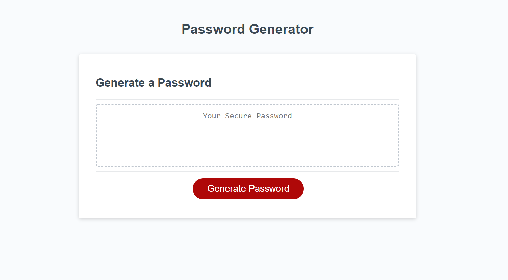

# Random Password Generator

## Purpose
The purpose of this web page is to generate a random password for the user. The user will choose the length of their password (between 8 and 128 characters) Then they will be given the options to choose if they want to include uppercase characters, lowercase characters, special characters, and/or numbers. The password generator will then give the user a password length that they've chosen containing the types of characters that they have chosen. 

## Built With
* HTML
* CSS
* JavaScript

## Preview

## Website
https://allielynne20.github.io/wk-two-challenge/

## Contribution
I worked on this project with a study group and a Teaching Assistant. The members of our study group were: Carolina Cabrera, Josh Hall, Shaun Mardones, Joesph Klein, and Teaching Assistant Alex Costan. 

Made with ❤️ by [Allie Watkins]
